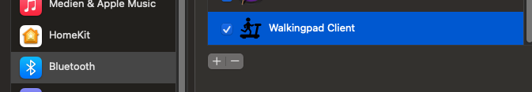
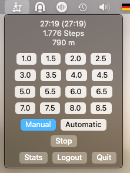
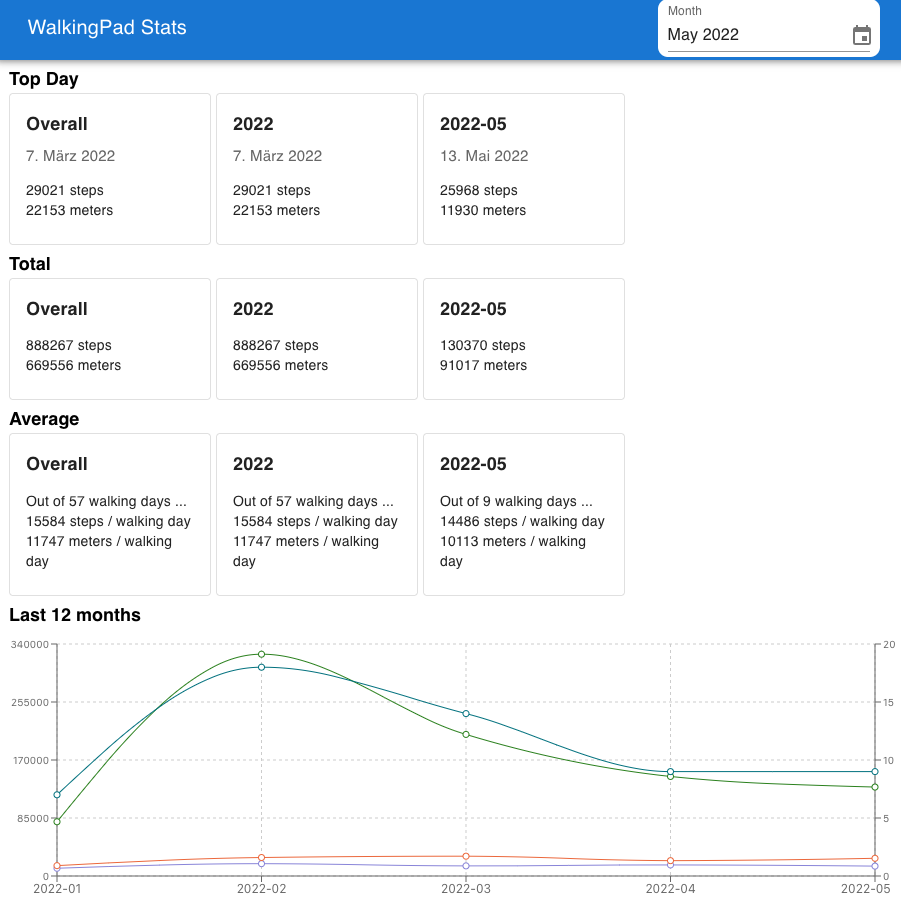

#  WalkingPad MacOS Client

A native MacOS Client (as status bar app) to watch your steps.


### Features

* Connect to your treadmill via Bluetooth
* Watch your steps, the app will accumulate the steps
* You can change the speed directly in the app
* GoogleFit support - connect the app to your Google Fit account. Whenever you pause or stop the treadmill, the steps will be uploaded to Google Fit.
* Statistics - the app will remember the times you walked before and give you some statistics on how much you have walked in the past
* [Alfred](https://www.alfredapp.com/) Workflow to control your treadmill by keystroke. You can download the workflow [here](https://github.com/klassm/walkingpad_alfred/releases)
* Publish the WalkingPad state as MQTT message (>= 0.0.3)

### Installation

Download the latest release from the [releases section](https://github.com/klassm/walkingpad_macos_client/releases).

Please make sure to grant the app Bluetooth permissions, to ensure the app can communicate with the WalkingPad device.



#### MQTT Configuration

You can publish the current WalkingPad state as MQTT message. An example use case is to use the current state
for automations in your favorite home automation tool like Home Assistant.

To configure the app to use MQTT, you need to provide a config file containing the connection data. Please
place this file in `~/Library/Containers/klassm.walkingpad-client/Data/Library/Autosave Information/.walkingpad-client-mqtt.json`
(this is quite a complex path, however it does not require any additional permissions to read it).

```json
{
  "username": "myusername",
  "password": "mypassword",
  "host": "192.168.0.73",
  "port": 1883,
  "topic": "homeassistant/sensor/walkingpad"
}
```

The app will automatically read the config data and start to publish messages.

An example message looks like the following:
```
{
    "speedKmh":1.5,
    "stepsTotal":19202,
    "distanceTotal":4690,
    "stepsWalkingpad":510
}
```

Home Assistant can afterwards be configured to read the data.

```yaml
mqtt:
  sensor:
    - name: "WalkingPad Speed"
      object_id: "walkingpad_speed"
      state_topic: "homeassistant/sensor/walkingpad"
      value_template: "{{ value_json.speedKmh }}"
      unit_of_measurement: "km/h"
    - name: "WalkingPad Steps"
      object_id: "walkingpad_steps"
      state_topic: "homeassistant/sensor/walkingpad"
      value_template: "{{ value_json.stepsTotal }}"
      unit_of_measurement: "Steps"
```

### Screenshots





### Credits

The implementation is heavily inspired by [ph4r05/ph4-walkingpad](https://github.com/ph4r05/ph4-walkingpad).
